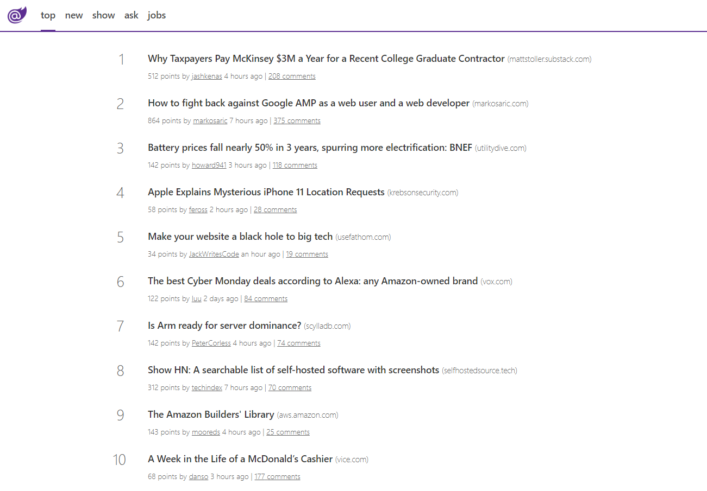
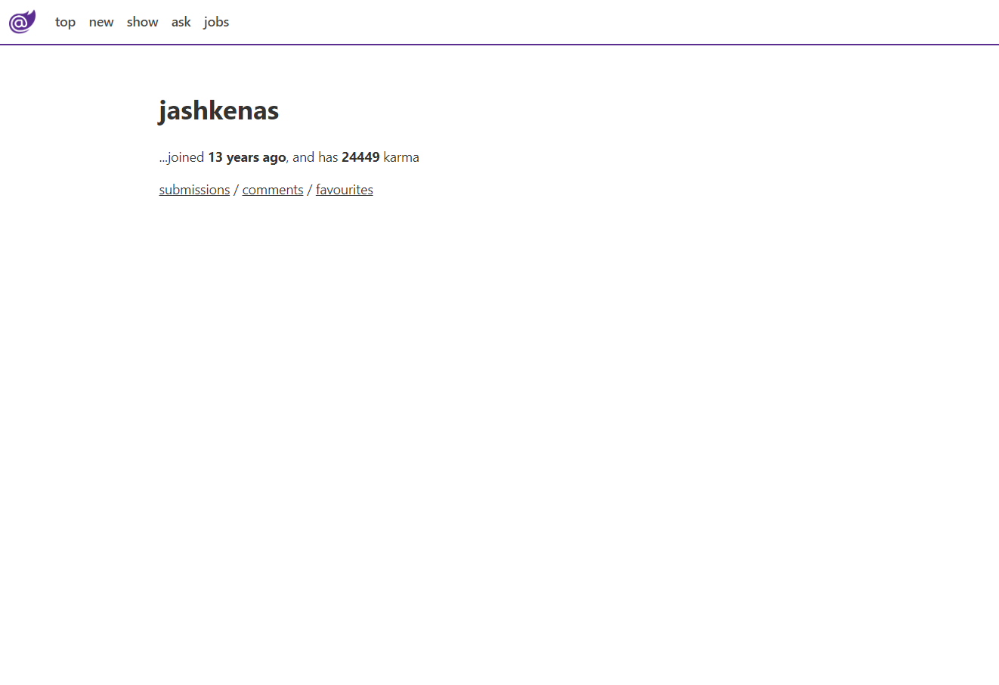

# blazor-hackernews

HackerNews clone built with Blazor

Live: [blazor-hackernews.surge.sh](http://blazor-hackernews.surge.sh)

## Pre-requisites
1) Install [.NET Core 3.1 SDK](https://dotnet.microsoft.com/download/dotnet-core/3.1)
2) Install Visual Studio 2019 16.4.0
3) Install the Blazor templates
```bash
dotnet new -i Microsoft.AspNetCore.Blazor.Templates::3.1.0-preview4.19579.2
```
## Screenshots
### Items Page


### Item Detail Page


### User Detail Page
